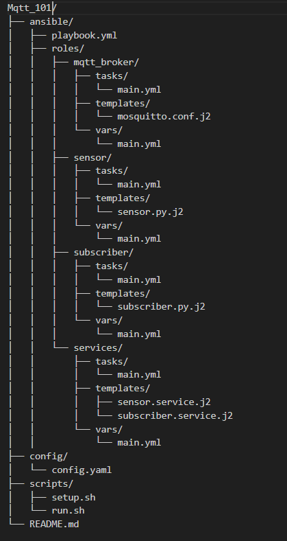

# IoT Project with MQTT

This project sets up a simple IoT system using MQTT on a Raspberry Pi.

## Setup

1. Clone this repository to your Raspberry Pi.
2. Run the setup script:
   ```
   bash scripts/setup.sh
   ```

This will install all necessary dependencies and configure the system.

## Running the Project

To start the sensor and subscriber services and view their logs:

```
bash scripts/run.sh
```

## Components

- MQTT Broker: Mosquitto
- Sensor: Publishes random temperature data every 5 seconds
- Subscriber: Subscribes to the temperature data and prints it

## File Structure

[]

## Customization

You can modify the sensor and subscriber scripts in the `roles/sensor/templates/sensor.py.j2` and `roles/subscriber/templates/subscriber.py.j2` files respectively.

To change the MQTT topic or other settings, modify the variables in the respective role's `vars/main.yml` file.